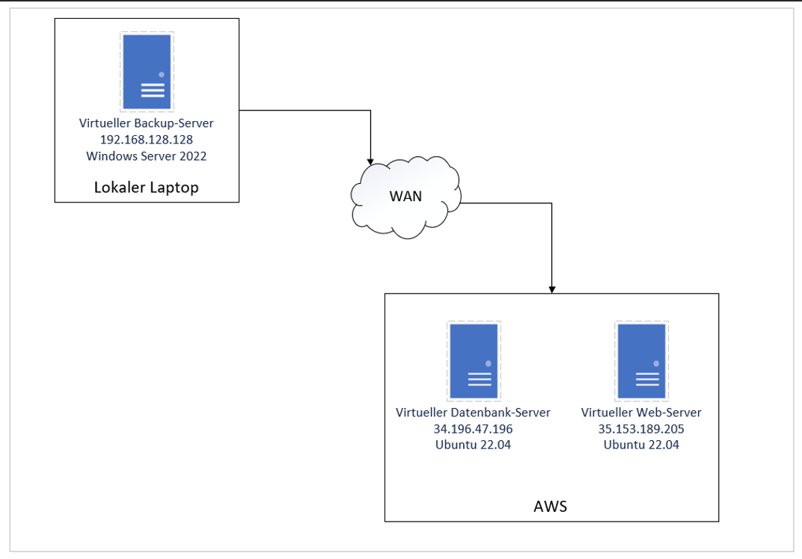

# Dokumentation Modul 143
## von Yassin Sobhy

### Inhalt
Netzwerkschema
1. Einführung
2. Zielgruppe
3. Ziele einer Sicherheitsumgebung
4. Begriffserklärungen
5. Allgemeine Anforderungen
6. Netzwerke
7. Computerhardware
8. Systemdefinitionen
9. Betriebssysteme
10. Partitionierungen
11. Einsatzzweck
12. Speichersysteme
13. Spezialsoftware
14. Systemverwaltung
15. Der Zugang zum System
16. Datensicherung
17. Daten, die gesichert werden
18. Erstellung und Konfigurierung der VMs
19. Funktion der Infrastruktur

# Netzwerkschema

## 1. Einführung
In diesem Dokument wird festgehalten, wie ich die Infrastruktur aufgebaut habe.

### 2. Zielgruppe
Kunde und IT Verwaltung.

### 3. Ziele einer Sicherheitsumgebung
Die Umgebung muss mit Backups ausgestattet sein, im Falle eines Datenverlustes oder Hacker Angriff. Ausserdem muss die Umgebung mit Passwörter und SSH Keys geschützt sein.

### 4. Begriffserklärungen
OS = Operating System = Betriebssystem
Partition = Eine unterteilung der Festplatte
NTFS = Dateisystem für die Festplatte
SCP = Secure Copy
SSH = Secure Shell, mit dem kann man sich auf ein Gerät verbinden.
RDP = Remote Desktop, ermöglicht Verbundungen zu anderen Geräten im gleichen Netzwerk.
SQL = Eine Datenbank Art.

## 5. Allgemeine Anforderungen
### 6. Netzwerke
192.168.128.0 – 192.168.128.255/24
172.31.64.0 – 172.31.95.255/20
172.31.0.0 – 172.31.15.255/20

### 7. Computerhardware
Es gibt keine physische Hardware in dem Sinne, nur die Hardware der Virtuellen Server.

## 8. Systemdefinitionen
### 9. Betriebssysteme
Der Backupserver ist mit Windows Server 2022 Standard ausgestattet. Die beiden Linux Server mit Ubuntu Server 22.4.

### 10. Partitionierungen
Es gibt je 2 Partition pro Server, die System Partition auf dem das OS* läuft und dann die Partition* mit den Daten.

### 11. Einsatzzweck
Die Umgebung wird genutzt, um Daten in eine Datenbank abspeichern zu können und eine Webseite hosten zu können. Dazu wird dies noch gesichert im Falle eines Datenverlusts.

### 12. Speichersysteme
Der Backupserver ist dafür da, um Backups der beiden Linux Server zu erstellen. Die Backups werden auf der NTFS* formatierten Festplatte gespeichert.

### 13. Spezialsoftware
Der Backupserver benützt SCP* um die Daten von den Zielservern zu kopieren.

## 14. Systemverwaltung
### 15. Der Zugang zum System
Der Zugriff erfolgt über SSH*. Der Backupserver ist auch über RDP* möglich (aber nur weil er lokal auf meinem Laptop ist.)

## 16. Datensicherung
### 17. Daten, die gesichert werden
Die Webseiten auf dem Webserver werden zusammen mit den SQL* Datenbanken gesichert. Das Betriebssystem wird nicht gesichert.

## 18. Erstellung und Konfigurierung der VMs
Als erstes habe ich die den Windows Backup Server auf meinem lokalen Laptop installiert. Ich habe ihm 60 GB Speicher gegeben da dies für die kleine Menge, die wir backuppen am Anfang völlig ausreichen wird. Falls der Speicher knapp wird, kann man ihn nach belieben vergrössern.
Danach folgten die beiden Linux Server in der AWS Umgebung. Hier hatte ich einbisschen mehr mühe, obwohl ich schon mit AWS gearbeitet habe. Immer wieder gab es fehler und etwas funktionierte nicht wie ich es wollte. Insgesamt musste ich ca. 10 neue Server aufsetzen. Der eine Server war ein Web Server und der andere eine SQL Datenbank. Beide Server sind mit SSH zugänglich, haben aber eine SSH Key Authentifizierung, mit welcher man sich nur Verbinden kann, wenn man den richtigen Private Key hat. Auf allen drei Servern habe ich SSH Scripte erstellt mit denen ich einfach, ohne jedes Mal den Befehl mit dem passenden Schlüssel einzugeben, mich mit dem gewünschten Server verbinden kann. Jeder Server hat Zugriff auf jeden. Ausserdem ist der lokale Backup Server per RDP erreichbar.
Ganz wichtig war auch die richtige konfigurierung der Sicherheitsgruppen. Davon habe ich zwei neue erstellt. Die eine für den Web Server habe ich «WEB» genannt, und die für den SQL natürlich «SQL». Beide Sicherheitsgruppen haben die Ports 22 und 80 offen. 22 für SSH und 80 für http. Die SQL Sicherheitsgruppe hat zusätzlich noch den Port 1433 offen für MSSQL. Das sind die eingehenden Regeln. Ausgehend ist alles erlaubt.
Alle Server haben eine fixe IP bekommen, vor alle bei den AWS Servern war mir das wichtig da, wenn ich einen neuen Server aufsetzen musste, die ganze Zeit eine neue IP zugewiesen wurde und alle Scripte, welche auf den IP Adressen basieren, nicht mehr funktioniert hätten und wieder mühsam angepasst hätten werden müssen. 
Der Web Server hat als Anwendung Apache2 installiert, damit auch eine Webseite zustande kam, auf welche man zugreifen kann. Dazu kommt auch noch PHP. Der SQL Server hat nur MSSQL installiert. Beide haben kein Passwort für den Root konfiguriert, was für die Aufsetzung von Vorteil war und mir auch einige Nerven gespart hat. Wenn es gewünscht ist, kann natürlich ein Passwort festgelegt werden.

## 19. Funktion der Infrastruktur
Die ganze Infrastruktur funktoniert so, dass die beiden Linux Server sebstständig ein Backup erstellen. Beim SQL Server wird logischerweise die SQL Datenbank gesichert und in ein Dump File gespeichert, anders wie beim Web Server. Dort werden die ganzen Web Dateien gesichert und in eine komprimierte Datei abgespeichert. Dazu wird direkt, wenn das Backup automatisch mit einem Cronjob ausgeführt wird, ein anderes Script ausgeführt welches automatisch das ältere Backup vom Server löscht. So wird sichergestellt das immer nur das neuste Backup auf den Linux Servern liegen und nicht zu viel Speicher verbraucht wird. 10 Minuten später führt der Windows Backup Server seinerseits ein Script aus, welches per SSh auf den jeweiligen Server geht und die Backup Datei mit SCP (Secure Copy) hinüberkopiert. Danach wird die Datei in einem zugewiesenen Ordner abgelegt. Dieser Vorgang ist mit der Windows Aufgabenplanung automatisiert. Falls die Sicherung auf seiten der Linux Server länger dauern sollte, durch grössere Backups zum Beispiel, kann auch die Zeit, bis das Kopieren in Kraft tritt, individuell angepasst werden.
