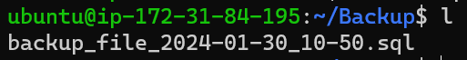
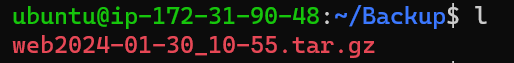
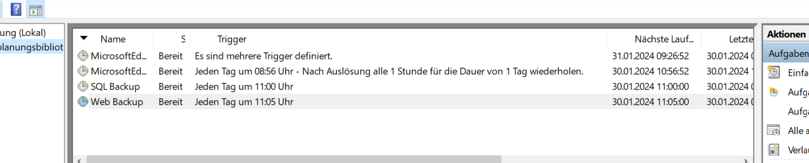
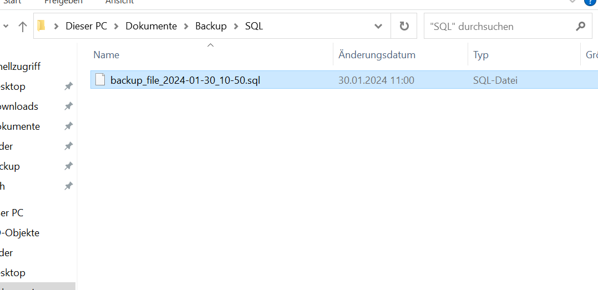
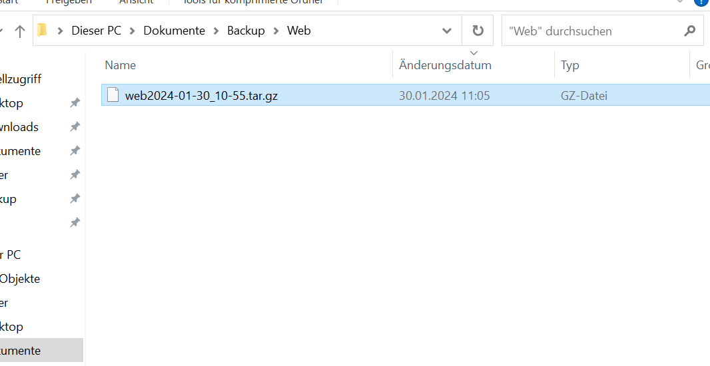

# Dokumentation Modul 143
## von Yassin Sobhy


### Inhalt
Netzwerkschema
1. [Einführung](#1-einführung)
2. [Zielgruppe](#2-zielgruppe)
3. [Ziele einer Sicherheitsumgebung](#3-ziele-einer-sicherheitsumgebung)
4. [Begriffserklärungen](#4-begriffserklärungen)
5. [Allgemeine Anforderungen](#5-allgemeine-anforderungen)
6. [Netzwerke](#netzwerkschema)
7. [Computerhardware](#7-computerhardware)
8. [Systemdefinitionen](#8-systemdefinitionen)
9. [Betriebssysteme](#9-betriebssysteme)
10. [Partitionierungen](#10-partitionierungen)
11. [Einsatzzweck](#11-einsatzzweck)
12. [Speichersysteme](#12-speichersysteme)
13. [Spezialsoftware](#13-spezialsoftware)
14. [Systemverwaltung](#14-systemverwaltung)
15. [Der Zugang zum System](#15-der-zugang-zum-system)
16. [Datensicherung](#16-datensicherung)
17. [Daten, die gesichert werden](#17-daten-die-gesichert-werden)
18. [Erstellung und Konfigurierung der VMs](#18-erstellung-und-konfigurierung-der-vms)
19. [Funktion der Infrastruktur](#19-funktion-der-infrastruktur)
20. [Anforderungen](#20-anforderungen)
21. [Scripte](#21-scripte)
22. [Ausfall](#22-ausfall)
[User Story](#user-story-m143)
# Netzwerkschema


## 1. Einführung
In diesem Dokument wird festgehalten, wie die Infrastruktur mit einem Windows Backup Server, und zwei Linux Maschinen aufgebaut wurde.

### 2. Zielgruppe
Kunde und IT Verwaltung.

### 3. Ziele einer Sicherheitsumgebung
Die Umgebung muss mit Backups ausgestattet sein, im Falle eines Datenverlustes oder Hacker Angriff, um die Datenwiederherstellen zu können. Ausserdem muss die Umgebung mit Passwörtern und SSH Keys geschützt sein.

### 4. Begriffserklärungen
OS = Operating System = Betriebssystem <br>
Partition = Eine unterteilung der Festplatte <br>
NTFS = Dateisystem für die Festplatte <br>
SCP = Secure Copy <br>
SSH = Secure Shell, mit dem kann man sich auf ein Gerät verbinden. <br>
RDP = Remote Desktop, ermöglicht Verbundungen zu anderen Geräten im gleichen Netzwerk. <br>
SQL = Eine Datenbank Art. <br>

## 5. Allgemeine Anforderungen
### 6. Netzwerke
192.168.128.0 – 192.168.128.255/24 <br>
172.31.64.0 – 172.31.95.255/20 <br>
172.31.0.0 – 172.31.15.255/20 <br>

### 7. Computerhardware
Es gibt keine physische Hardware in dem Sinne, nur die Hardware der Virtuellen Server. Da ich es nur im Lernender Lab gemacht habe, konnte ich die Hardware nicht genau auf die bedurfnisse eines Kunden anpassen, da es zu teuer geworden wäre. Der lokale Backup Server hat 2GB RAM, 2 Prozessoren und 60GB Speicher, welcher aber erweitert werden kann. Der Web Server hat eine CPU, 1GB Ram und 8GB Speicher, auch erweiterbar. Der SQL Server hat 30GB Speicher, auch erweiterbar, 2GB RAM und 1 CPU.

## 8. Systemdefinitionen
### 9. Betriebssysteme
Der Backupserver ist mit Windows Server 2022 Standard ausgestattet. Die beiden Linux Server mit Ubuntu Server 22.4.

### 10. Partitionierungen
Es gibt je 2 Partition pro Server, die System Partition auf dem das OS* läuft und dann die Partition* mit den Daten.

### 11. Einsatzzweck
Die Umgebung wird genutzt, um Daten in eine Datenbank festhalten zu können und eine Webseite hosten zu können. Dazu wird dies noch gesichert im Falle eines Datenverlusts.

### 12. Speichersysteme
Der Backupserver ist dafür da, um Backups der beiden Linux Server zu erstellen. Die Backups werden auf der NTFS* formatierten Festplatte gespeichert.

### 13. Spezialsoftware
Der Backupserver benützt SCP* um die Daten von den Zielservern zu kopieren.

## 14. Systemverwaltung
### 15. Der Zugang zum System
Der Zugriff erfolgt über SSH*. Der Backupserver ist auch über RDP* möglich (aber nur weil er lokal auf meinem Laptop ist.) Der Web Server bzw. die Webseite des Webservers ist auch über den Browser zugänglich. Um die Webseiten zu Verwalten muss man sich jedoch mit SSH verbinden.

## 16. Datensicherung
### 17. Daten, die gesichert werden
Die Webseiten auf dem Webserver werden zusammen mit den SQL* Datenbanken gesichert. Das Betriebssystem wird nicht gesichert da man dies auf einem Bootstick abspeichern kann und dann beliebig oft benutzen kann. Normalerweise sind die Angreifer auch nicht am Betriebssystem sonder an den Daten interessiert sind.

## 18. Erstellung und Konfigurierung der VMs
Als erstes habe ich die den Windows Backup Server auf meinem lokalen Laptop installiert. Ich habe ihm 60 GB Speicher gegeben da dies für die kleine Menge, die wir backuppen am Anfang völlig ausreichen wird. Falls der Speicher knapp wird, kann man ihn nach belieben vergrössern. Die Updates habe ich durchlaufen lassen damit alles auf dem neuesten Stand ist und mögliche Sicherheitslücken geschlossen sind. <br>
Danach folgten die beiden Linux Server in der AWS Umgebung. Hier hatte ich einbisschen mehr mühe, obwohl ich schon mit AWS gearbeitet habe. Immer wieder gab es fehler und etwas funktionierte nicht wie ich es wollte. Insgesamt musste ich ca. 15 neue Server aufsetzen. Der eine Server war ein Web Server und der andere eine SQL Datenbank. Beide Server sind mit SSH zugänglich, haben aber eine SSH Key Authentifizierung, mit welcher man sich nur verbinden kann, wenn man den richtigen Private Key hat. Auf allen drei Servern habe ich SSH Scripte erstellt mit denen ich einfach, ohne jedes Mal den Befehl mit dem passenden Schlüssel einzugeben, mich mit dem gewünschten Server verbinden kann. Jeder Server hat Zugriff auf jeden. Die SSH Keys sind in einem Verzeichnis auf welches nur der Autor Vollzugriff hat, der Rest hat nur lese Rechte. Auch der Windows Server hat zwei SSH Scripte für die Verbindung der Linux Maschinen da es einfach schneller geht als es jedes mal einzutippen. Um auf den Windows Server zu kommen kann man RDP benützen. <br>
Ganz wichtig war auch die richtige konfigurierung der Sicherheitsgruppen. Davon habe ich zwei neue erstellt. Die eine für den Web Server habe ich «WEB» genannt, und die für den SQL natürlich «SQL». Beide Sicherheitsgruppen haben den Port 22 offen. 22 für SSH steht für SSH. Die SQL Sicherheitsgruppe hat zusätzlich noch den Port 1433 offen für MSSQL und der Web Server den Port 80 für HTTP. Das sind die eingehenden Regeln. Ausgehend ist alles erlaubt.<br>
Alle Server haben eine fixe IP bekommen, vor alle bei den AWS Servern war mir das wichtig da, wenn ich einen neuen Server aufsetzen musste, die ganze Zeit eine neue IP zugewiesen wurde und alle Scripte, welche auf den IP Adressen basieren, nicht mehr funktioniert hätten und wieder mühsam angepasst hätten werden müssen. 
Der Web Server hat als Anwendung Apache2 installiert, damit auch eine Webseite zustande kam, auf welche man zugreifen kann. Dazu kommt auch noch PHP. Der SQL Server hat nur MSSQL installiert.

## 19. Funktion der Infrastruktur
Die ganze Infrastruktur funktoniert so, dass die beiden Linux Server sebstständig ein Backup erstellen. Beim SQL Server wird logischerweise die SQL Datenbank gesichert und in ein Dump File gespeichert, anders wie beim Web Server. Dort werden die ganzen Web Dateien gesichert und in eine komprimierte Datei abgespeichert. Dazu wird direkt, wenn das Backup automatisch mit einem Cronjob ausgeführt wird, ein anderes Script ausgeführt welches automatisch das ältere Backup vom Server löscht. So wird sichergestellt das immer nur das neuste Backup auf den Linux Servern liegen und nicht zu viel Speicher verbraucht wird. 10 Minuten später führt der Windows Backup Server seinerseits ein Script aus, welches per SSh auf den jeweiligen Server geht und die Backup Datei mit SCP (Secure Copy) hinüberkopiert. Danach wird die Datei in einem zugewiesenen Ordner abgelegt. Dieser Vorgang ist mit der Windows Aufgabenplanung automatisiert. Falls die Sicherung auf seiten der Linux Server länger dauern sollte, durch grössere Backups zum Beispiel, kann auch die Zeit, bis das Kopieren in Kraft tritt, individuell angepasst werden. Die Scripte sind nur für den Administrator zugänglich und können von anderen Benutzern nicht verändert werden. Wäre ja noch schöner.<br>

Hier sind die beiden Beiden Backup Bilder. Es hatte vorher schon ein Backup drauf, das wurde automatisch nach der erstellung des neuen Backups gelöscht.<br>





Die Cronjobs sehen so aus:<br>


Nach 10 min werden die Backups automatisch auf den Backup Server rübergezogen. Hier sieht man die automatisierung in der Aufgabenplanung und die Backups des heutigen Tages mit Datum, welche erfolgreich auf den Backupserver kopiert wurden:







## 20. Anforderungen
Die AWS Umgebung die ich genutzt habe war eine Test Umgebung und keine richtige daher sind die Ressourcen der Server im Moment eingeschränkt und nicht komplett verfügbar. Um den Wünschen des Kunden gerecht zu werden könnte man AWS auch kaufen und im Business benützen was aber erheblich teuerer wird als die kleine Testumgebung hier. Mann kommt auf knapp 1000 USD im Jahr was auch nicht die Welt ist aber trotzdem. Meine Server haben sehr wenige Ressourcen. Der SQL hat nur 2GB RAM damit ich das SQL installieren konnte. Der andere Linux Server hat nur ein GB RAM, beide mit einer vCPU. Der Backup Server auf meinem lokalen System hat mehr. 2GB RAM 2 vCPUs. Das ist unter normalen Umständen zu wenig. Die SQL Datenbank sollte mindestens 2GB RAM haben, zusammen mit mindestens 1CPU. Beim Speicher kommt es darauf an wie viel Daten man in der Datenbank hat. Für den Anfang würde ich sagen 100GB. Der Web Server braucht auch nicht so viel, 1GB RAM reicht bei 1-4 Webseiten danach wird es kritisch und 2 oder mehr wären the way to go. 1 CPU Mindestens. Speicher braucht es nicht viel da die Webseiten nicht vile Platz verbrauchen, darum denke ich 50-60 GB als Start. Der Backupserver muss vor allem auf seinen Speicher achten. Wenn die Datenbank riesig ist braucht auch der Backup Server ordentlich Platz. Hier würde ich auch sagen 1GB RAM, 1 CPU und 100GB.

## 21. Scripte

Das sind die beiden Scripte für die Verbindung von meinem Laptop auf die Linux Maschinen. Diese Scripte sind auch im Git unter Verbindungen abgelegt:<br>
```bash
ssh ubuntu@34.196.47.196 -i "C:\Users\yassin.sobhy\OneDrive - voicelan.ch\Dokumente\SSH Keys\M143.pem"
ssh ubuntu@35.153.189.205 -i "C:\Users\yassin.sobhy\OneDrive - voicelan.ch\Dokumente\SSH Keys\M143.pem"
```


Das -i ist der Parameter um dann den SSH Key anzugeben. In diesem Fall jetzt heisst der Key M143.pem.

Auf dem Backup Server gibt es auch die SSH Scripts. Hier sind die SSH Keys einfach an einem anderen Ort abgelegt aber Grundsätzlich ist das Script gleich:<br>
```bash
ssh ubuntu@34.196.47.196 -i "C:\Users\Administrator\Documents\M143.pem"
ssh ubuntu@35.153.189.205 -i "C:\Users\Administrator\Documents\M143.pem"
```


Nun folgen die Scripts alle vom SQL Server:<br>

backup.sh für das Backup:<br>
```bash
#!/bin/bash
timestamp=$(date +%Y-%m-%d_%H-%M)
mysqldump -u sqlbackup test_db > /home/ubuntu/Backup/backup_file_$timestamp.sql
```

sql.sh für die Verbindung mit der SQL Datenbank:<br>
```bash
sudo mysql -u root -p
```

ssh.sh für die SSH Verbindung:<br>
```bash
sudo ssh ubuntu@35.153.189.205 -i /home/ubuntu/Key/M143.pem
```

delet_oldest.sh ist dafür da um jedes mal beim Backup das ältere Backup automatisch zu löschen damit Platz gespart wird:<br>
```bash
#!/bin/bash

backup_dir="/home/ubuntu/Backup"

files=("$backup_dir"/*.sql)

if [ ${#files[@]} -gt 1 ]; then
    oldest_file=$(ls -1t "${files[@]}" | tail -n 1)
    echo "Älteste Datei: $oldest_file"
    rm "$oldest_file"
fi
```


Nun folgen die Scripts alle vom Web Server:<br>

backup.sh für das Backup:<br>
```bash
#!/bin/bash
timestamp=$(date +%Y-%m-%d_%H-%M)
tar -czvf /home/ubuntu/Backup/web$timestamp.tar.gz /var/www/html
```

ssh.sh für die SSH Verbindung:<br>
```bash
sudo ssh ubuntu@34.196.47.196 -i /home/ubuntu/Key/M143.pem
```

delete_oldest.sh für Löschung der älteren Backup Datei:<br>
```bash
#!/bin/bash

backup_dir="/home/ubuntu/Backup"

files=("$backup_dir"/web*.tar.gz)

if [ ${#files[@]} -gt 1 ]; then
    oldest_file=$(ls -1t "${files[@]}" | tail -n 1)
    echo "Älteste Datei: $oldest_file"
    rm "$oldest_file"
fi
```

Und hier noch die SQL Datenbank welche ich zum test genutzt habe:<br>
```SQL
CREATE DATABASE test_db;
 
USE test_db;
 
CREATE TABLE users (
  id INT PRIMARY KEY AUTO_INCREMENT,
  username VARCHAR(255) UNIQUE NOT NULL,
  email VARCHAR(255) UNIQUE NOT NULL,
  password VARCHAR(255) NOT NULL
);
 
INSERT INTO users (username, email, password)
VALUES
  ('johndoe', 'johndoe@example.com', 'password123'),
  ('janedoe', 'janedoe@example.com', 'password456'),
  ('petersmith', 'petersmith@example.com', 'password789');
 
CREATE TABLE posts (
  id INT PRIMARY KEY AUTO_INCREMENT,
  title VARCHAR(255) NOT NULL,
  content TEXT NOT NULL,
  user_id INT NOT NULL,
  created_at DATETIME NOT NULL DEFAULT CURRENT_TIMESTAMP,
  updated_at DATETIME NOT NULL DEFAULT CURRENT_TIMESTAMP ON UPDATE CURRENT_TIMESTAMP,
  FOREIGN KEY (user_id) REFERENCES users(id)
);
 
INSERT INTO posts (title, content, user_id)
VALUES
  ('My First Post', 'This is my first post on the test blog.', 1),
  ('Another Post', 'This is another post on the test blog.', 2),
  ('Third Post', 'This is the third post on the test blog.', 3);
```

## 22. Ausfall
Im Falle eines Ausfalls muss sofort gehandelt werden. Wenn es einen AWS Server betrifft kann sofort mithilfe eines Cloud Init Files der Server neu aufgesetzt werden. Die Cloud Init Files dienen dazu den Server beim ersten Starten direkt schon zu konfigurieren und Pakete mitzuliefern. Das Cloud Init für den SQL Server sieht folgendermassen aus:<br>
```yaml
#cloud-config 
users:   
  - name: ubuntu     
    sudo: ALL=(ALL) NOPASSWD:ALL     
    groups: users, admin     
    home: /home/ubuntu     
    shell: /bin/bash     
    ssh_authorized_keys:       
      - ssh-rsa 
AAAAB3NzaC1yc2EAAAADAQABAAABAQCTdIZCRcREsAOO8o/dQ/neiUGycSZdRSxQhmFcfki3UXzT7pSRsqdMuHSPbPu18tT4bqoZUiw9onMzS/Gi0mACSA7ZCePlpUVTU/cTf2bzqNCYRwM3P7Sqsp7sS94MtwmGiuVuDTaLRLi5h4i9OP7c8lnsMyFgqDLyo8eq0b/RubqgLwK3H6O7z8vDwYrNYwrNaPaTR4pBpqzct9B8M2jNanUYbIx/eVW8ncOLXXwrHAfoFAyfYA1qMhn5Kl68O2cGhcNLiaXB3TGV40vsroWKBXKLH66L8V9/VjIC3y92xAMwd2IrAfqmzxsE408n4Owo/krymvvvmo2lGd7bYGID aws-key

ssh_pwauth: false 
disable_root: false 
package_update: true 
packages:   
  - curl   
  - wget 
```

Dann muss nur noch SQL installiert werden mit dem Befehl: "sudo apt-get install -y mssql-server
". Dann muss man das setup ausführen: "sudo /opt/mssql/bin/mssql-conf setup". Dann kommen verschiedene Versionen welche man anwählen kann. Ich habe 3 genommen; Express. Wenn man ich echten Fall eine Lizenz erwirbt wählt man 1 oder 2 aus. Dann kommen noch ein paar fragen und dann wird SQL auch schon installiert.<br>
Jetzt muss noch der Benutzer wieder für das erstellen der Dump Files erstellt werden (das aber in SQL). In meinem Fall heisst der SQLBackup.<br>
```SQL
CREATE USER 'SQLBackup'@'34.196.47.196' IDENTIFIED BY 'SQLBackup';
GRANT ALL PRIVILEGES ON test_db.* TO 'SQLBackup'@'34.196.47.196';
FLUSH PRIVILEGES;
```
Danach müssen die Scripts wieder erstellt werden was aber nicht lange geht. Ausser dem kann über den Backup Server dann das SQL Dump File heruntergeladen werden und damit die Datenbank wiederhergestellt werden.

Beim Web Server ist das Vorgehen genau gleich. Natürlich muss man kein SQL einrichten aber man kann ihn schnell Starten mit dem Cloud Init File, welches so aussieht:<br>
```yaml
#cloud-config
users:
  - name: ubuntu
    sudo: ALL=(ALL) NOPASSWD:ALL
    groups: users, admin
    home: /home/ubuntu
    shell: /bin/bash
    ssh_authorized_keys:
      - ssh-rsa AAAAB3NzaC1yc2EAAAADAQABAAABAQCTdIZCRcREsAOO8o/dQ/neiUGycSZdRSxQhmFcfki3UXzT7pSRsqdMuHSPbPu18tT4bqoZUiw9onMzS/Gi0mACSA7ZCePlpUVTU/cTf2bzqNCYRwM3P7Sqsp7sS94MtwmGiuVuDTaLRLi5h4i9OP7c8lnsMyFgqDLyo8eq0b/RubqgLwK3H6O7z8vDwYrNYwrNaPaTR4pBpqzct9B8M2jNanUYbIx/eVW8ncOLXXwrHAfoFAyfYA1qMhn5Kl68O2cGhcNLiaXB3TGV40vsroWKBXKLH66L8V9/VjIC3y92xAMwd2IrAfqmzxsE408n4Owo/krymvvvmo2lGd7bYGID aws-key


ssh_pwauth: false
disable_root: false
package_update: true
packages:
  - curl
  - wget
  - apache2
  - php-curl
  - libapache2-mod-php
  - php-mysqli
  - adminer

runcmd:
  - sudo a2enconf adminer
  - sudo systemctl restart apache2

write_files:

  - path: /var/www/html/db.php

    permissions: '0644'

    owner: root:root

    content: |

      <?php

      //database

      $servername = "34.196.47.196";

      $username = "admin";

      $password = "password";

      $dbname = "mysql";

 

      // Create connection

      $conn = new mysqli($servername, $username, $password, $dbname);

      // Check connection

      if ($conn->connect_error) {

          die("Connection failed: " . $conn->connect_error);

      }

 

      $sql = "select Host, User from mysql.user;";

      $result = $conn->query($sql);

      while($row = $result->fetch_assoc()){

          echo($row["Host"] . " / " . $row["User"] . "<br />");

      }

      //var_dump($result);

      ?>

  - path: /var/www/html/info.php

    permissions: '0644'

    owner: root:root

    content: |

      <?php

 

      // Show all information, defaults to INFO_ALL

      phpinfo();

 

      ?>
```

Dann kann die Webseite aus dem Backup Server wiederhergestellt werden und auf dem Server unter /var/www/html/ eingefügt werden. Danach erscheint die Seite wieder über den Browser unter http://35.153.189.205/testwebseite.php. Auch hier müssen die Scripts wieder erstellt werden.<br>

Die statischen IP Adressen müssen dann von der alten Maschine auf die neue übernommen werden, und zwar die IP vom SQL Server zum neuen SQL Server und die des Web Servers auf den neuen Web Server da es sonst ein durcheinander geben wird und nichts mehr gehen würde, da die IPs wichtig sind für die Server weil sie ansonsten dann nicht mehr wissen wo sie hin müssen um das Backup abzuholen und so weiter.

# User Story M143

Ich betreibe eine kleine Firma mit einer Webseite bei welcher sich Kunden anmelden können um unsere Dienste so gut nutzen zu können. Die Nutzerinformationen speichern wir in die Datenbank ab. Da ich ein vorsichtiger Mann bin und weiss was bei den Cyberattacken passieren kann würde ich gerne die folgenden Sachen Schützen: <br>
Die Web-Dateien auf dem Web Server sollen regelmäßig gesichert werden, sowie die SQL-Datenbank auf dem SQL Server ebenso. Die Backups sollen automatisiert durchgeführt werden. Die ältere Backups sollen automatisch gelöscht werden, um Speicherplatz zu sparen. <br>
Natürlich müssen auch die eingehenden Verbindungen zu den Servern eingeschränkt werden, nicht dass ungewollte Verbindungen zu stand kommen. Ausgehend dürfen die Verbindungen unbeschränkt sein. Der Datenbank Server sollte eingehend nur die Ports 22 für SSH Zugriff und 1433 für den SQL Zugriff. Der Web Server sollte die Ports 80 und 22 offen haben für HTTP und SSH. <br>
Feste IP-Adressen sollen für die Server für eine einfache Verwaltung zugewiesen werden. <br>
Die Backup-Zeiten sollen flexibel angepasst werden können, im Falle von langen Backups oder Verzögerungen.
Ausserdem wäre es schön wenn Infrastruktur acuh flexibel ist und einfach um neue Server erweitert werden kann, falls wir mal grösser werden.<br>
HTML-, CSS- und PHP-Dateien sollen auch auf dem Web Server platziert werden können um neue Webseiten schnell und einfach zu erstellen.
Die Webseite soll über den Webbrowser zugänglich sein.<br>
Die Server selber sollten über SSH-Verbindung erfolgen. Jedoch sollen die auch geschützt sein. Nur authorisierte Benutzer mit dem richtigen Private Key sollen Zugang zu den Servern haben, also sind Verbundungen ohne Authentifizierung asugeschlossen.